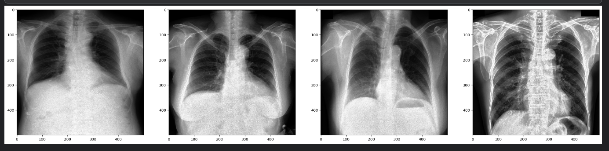
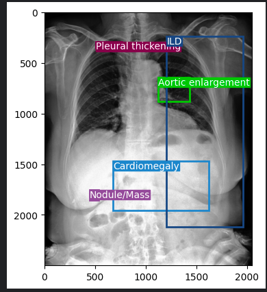
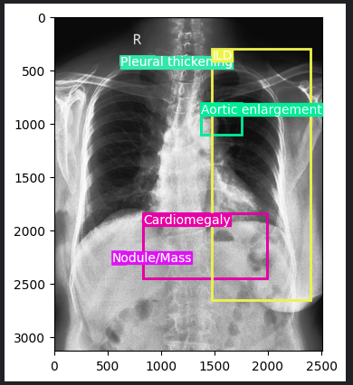
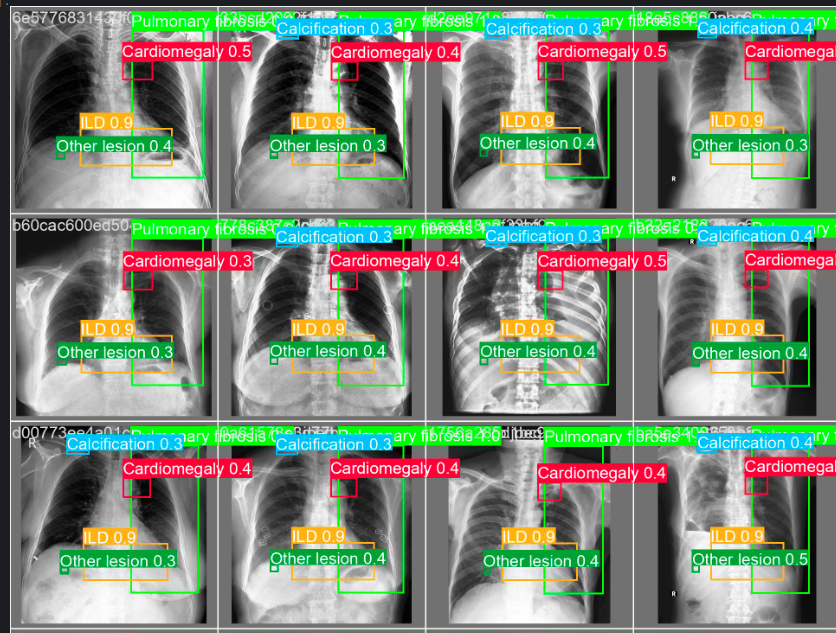
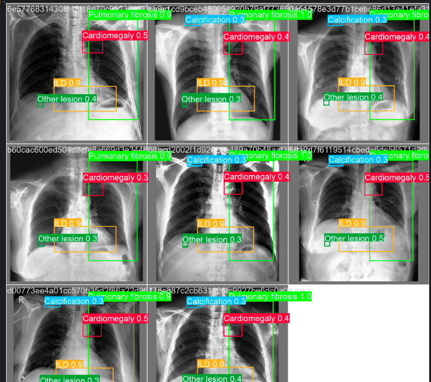

# Chest-X-ray-Abnormalities-YOLOv9
Automate thoracic abnormality localization and classification in chest X-rays using YOLOv9. Detects pneumonia, nodules, infiltrates, and more. Highly accurate and efficient for real-time diagnostics. Customizable and integrable for medical imaging systems

## ⚙️⚙️ Classification data ⚙️⚙️

## 🪛🪛Classified result🪛🪛
!

## ⚒️⚒️YOLOv9 Result⚒️⚒️
!

